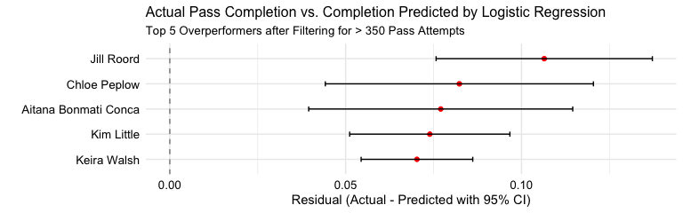

I was watching FC Barcelona Femeni and admiring the decision-making and technical competency of Aitana Bonmati. Obviously, with her recent back-to-back Ballon D'Or wins, I am not the only one recognizing the exceptional level she is playing at. However, watching her made me wonder what influences pass completion in women's soccer. I would assume that pressure and increasing pass length make passes less likely to be completed successfully just based on my own playing experience. With free data from Hudl Statsbomb, we can test exactly what influences successful and unsuccessful pass attempts in women's football and evaluate which players overperform the model predition. I would anticipate that Aitana is one of these overperformers, but this is just my bias :)  

The questions I want to answer are 1) how do pass length, pass angle, and pressure affect the pass completion and 2) who are the female soccer players who most outperform the xPass model prediction? Answering this question does more than just hopefully confirm my bias that Aitana is one of the best passers in the world. This statistical analysis could also inform
individual development plans, recruiting, scouting, and also player evaluations.  

The first step is to load the data from Hudl Statsbomb's free data and filter for only women's events.
```
# load women's competitions
Comp <- FreeCompetitions()%>%
  filter(competition_gender == "female")

# get all matches for those competitions
Matches <- FreeMatches(Comp)

# get event data for those matches and clean
StatsBombData <- free_allevents(MatchesDF = Matches, Parallel = T) 
StatsBombData = allclean(StatsBombData) 
```

Next, I'll filter for only including passes that take place during the regular passage of play (e.g., filter out dead ball scenarios) and for passes made with the feet (e.g., removing headers or other surfaces).
```
passes <- StatsBombData %>% 
  filter(type.name=="Pass" &  play_pattern.name == "Regular Play") %>% 
  # filter(str_detect(position.name, "Midfield")) %>% 
  filter(str_detect(pass.body_part.name, "Foot")) %>% 
  mutate(pass.outcome.name = ifelse(is.na(pass.outcome.name), "Complete", pass.outcome.name),
         pass.outcome.id = ifelse(is.na(pass.outcome.id), 1, pass.outcome.id)) 

```

And the final step before feature engineering involves calculating pass length and creating numeric columns for the actual analysis.
```
passes_clean <- passes %>%
  mutate(pass_distance = sqrt((pass.end_location.x - location.x)^2 + 
                              (pass.end_location.y - location.y)^2),
         pass_angle = atan2(pass.end_location.y - location.y, 
                            pass.end_location.x - location.x),
         pass_completed = ifelse(pass.outcome.name == "Complete", 1, 0),
         under_pressure_num = ifelse(is.na(under_pressure), 0, 1)
         ) %>%
  select(player.name, position.name, competition_id, season_id, team.name, pass.body_part.name, pass.recipient.name, pass.end_location, pass.outcome.name, under_pressure, pass_distance, pass_angle, under_pressure_num, pass_completed) # body_part

```

##### Logistic Regression  
I chose to apply logistic regression to create an "Expected Pass Model", or a model that evaluates how variables influence the likelihood of a given binary outcome (e.g., successful or unsuccessful pass). I personally think logistic regression is simple, interpretable, and effective this project. Unlike more complex models like XGBoost, logistic regression allows us to directly understand how different factors influence completion rates without needing extensive tuning or dealing with black-box predictions.  Its transparency makes it easier for me to communicate findings to coaches and analysts.  

Here, I select just the numeric columns that are needed for completing the analysis and then I split the data into a 'train' and 'test' dataset.
```
set.seed(123) # reproducibility

# remove categorical/character variables
passes_final <- passes_clean %>% 
  select(pass_completed, pass_distance, pass_angle, under_pressure_num) # body_part

train_data <- passes_final %>% sample_frac(0.8)
test_data <- anti_join(passes_final, train_data)
```

Here is where I actually use the train dataset to create the logistic regression "Expected Pass" model.
```
log_model <- glm(pass_completed ~ ., data = train_data, family = binomial)
summary(log_model)
exp(coef(log_model))
```   
There results show that:
**Pass Distance** 0.96:	A 1-unit increase in distance **decreases pass success by ~4% **
**Pass Angle** 1.028:	A 1-unit increase in angle **increases pass success by ~3%**
**Under Pressure** 0.63:	Under pressure, the odds of completion **drop by ~37%**  

The next thing I do is use predict() and the model to add a new column of the expected pass outcome. I then go ahead and create a 
residual (actual - predicted) column for each player and a 95% confidence interval. I also filter to only include players who have attempted > 350 passes. This is kind of artibitrary, but my goal was to exclude players who have very high pass completion rates because they did not attempt a lot of passes (because they don't have a lot of games or other reasons).
```
passes_final$expected_pass <- predict(log_model, passes_final, type = "response")

player_pass_performance <- passes_clean %>%
  mutate(expected_pass = passes_final$expected_pass) %>%
  filter(str_detect(position.name, "Midfield")) %>% 
  group_by(player.name) %>%
  summarise(
    actual_pass_completion = mean(pass_completed),
    expected_pass_completion = mean(expected_pass),
    pass_attempts = n(),
    residual = actual_pass_completion - expected_pass_completion,
    se = sqrt((expected_pass_completion * (1 - expected_pass_completion)) / pass_attempts),  # Correct SE
    lower_ci = residual - (1.96 * se),
    upper_ci = residual + (1.96 * se)
  ) %>%
  ungroup() %>% 
  filter(pass_attempts > 350)

```

The last thing I do is create a top 5 overperformers graph to see who exceeds the predicted pass completion by the largest margin.
```
top_five <- player_pass_performance %>% 
  slice_max(order_by = residual, n=5)

ggplot(top_five, aes(x = residual, y = reorder(player.name, residual))) +
  geom_point(color = "red") +  
  geom_errorbarh(aes(xmin = lower_ci, xmax = upper_ci), height = 0.2, color = "black") +  # CI bars
  geom_vline(xintercept = 0, linetype = "dashed", color = "black", alpha = 0.5) +  # Zero line
  labs(
    title = "Actual Pass Completion vs. Completion Predicted by Logistic Regression",
    subtitle = "Top 5 Overperformers after Filtering for > 350 Pass Attempts",
    x = "Residual (Actual - Predicted with 95% CI)",
    y = ""
  ) +
  theme_minimal() +
  theme(plot.title = element_text(size = 12),
        plot.subtitle = element_text(size = 10), 
        axis.text.x = element_text(size = 10, color = "black"),
        axis.text.y = element_text(size = 10, color = "black")) 

```



The results are a pleasant mix of surprising and not surprising. Starting with what is not surprising: the inclusion of Keira Walsh and Aitana Bonmati. However, they are not as high as I was expecting them to be. However, one major confounding variable is that Keira Walsh and Aitana (as well as other players, obviously), they only have data from the Women's World Cup and European Championships. Liga F is not included in Hudl Statsbomb. If there was data for this league, I'm sure these two players, maybe plus Patri, would be top 3. This also explains the inclusion of other players from the FA WSL - there is a larger data set for these players. It will be interesting to see how this changes as more seasons of data for other women's leagues and competitions begin to be included.