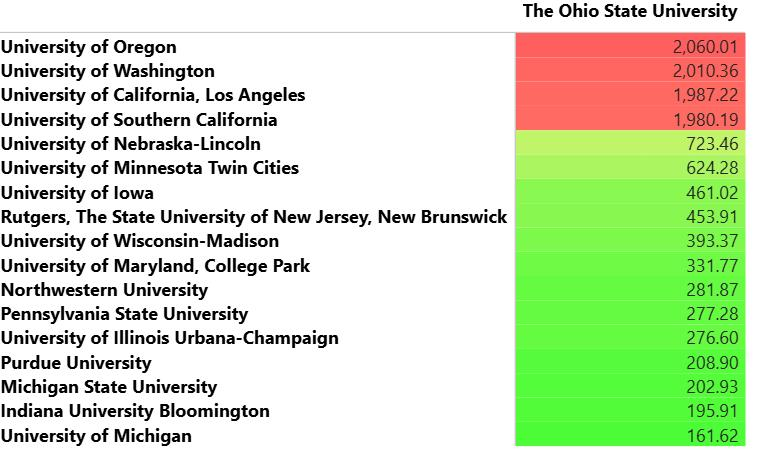
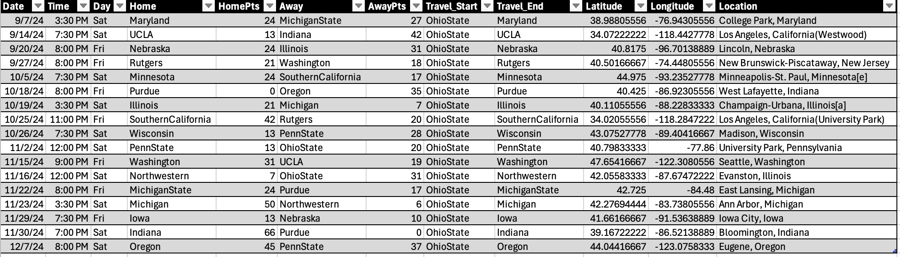
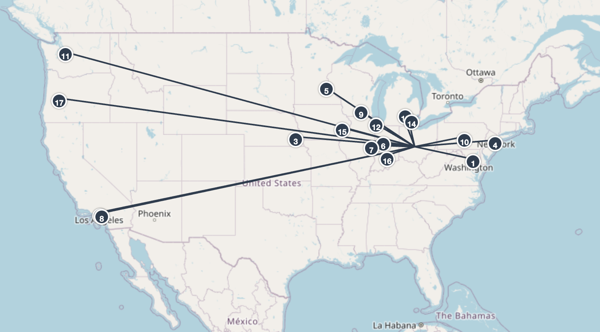

Managing and mitigating the negative effects of long-haul travel is a timely challenge facing collegiate athletics departments. This was particularly evident to me when I was watching the women's tennis NCAA tournament draw back in the spring. There were a remarkable number of teams that had to travel what I perceived to be substantial distances for their first round matches. It did not appear to me that the optimal set of match-ups was identified to minimize the distance traveled while maintaining the appropriateness (e.g., in terms of RPI or other indicators of competitive level) of the two teams competing. Ultimately, this is one of a few examples I can think of where a scheduling and route optimization data science problem would be relevant.

While building a 64-team NCAA women's tennis tournament would be a fun project, it would likely take quite a bit of bandwidth and computational power. I thought it would be good to start to demonstrate a simpler example of a scheduling and route optimization problem. To do this, I decided to start by taking the 2025 Big Ten football schedule and try to identify the route someone would need to take to visit every Big Ten football stadium for a home game while minimizing the total distance traveled when traveling from where I am: Columbus, Ohio 

The full project and the code to do all of the subsequently described web-scraping, cleaning, and analysis can be found at my github: https://github.com/emalyvatne/bigtenfootball_routeoptimization

#### Big Ten Football Context

Starting this data science problem involves collecting:  

1. The exact location (e.g., latitude and longitude) of each Big Ten stadium
2. The Big Ten football schedule

##### Big Ten School Details and Distance Matrix

The first assumption we will make in this problem is that the stadium is located in a negligible distance from the latitude and longitude of the city that the university is listed in. This also means we are not accounting for certain things such as mode of travel (e.g., driving versus flying) and ancillary details such as distance between a given airport and that stadium. While these things will inevitably add up when traveling to 18 schools, we are overlooking these details for the sake of this optimization problem example. In a more comprehensive approach to this question, I would like to have included the flight tracker API and Google Maps API to account for more accurate estimates of distances and durations traveled. With all of that being said, we'll proceed with this question by obtaining the latitude and longitude of the Big Ten institutions by using a simple webscraper to collect this information off of Wikipedia: 

```
import pandas as pd
from bs4 import BeautifulSoup
import requests
from lat_lon_parser import parse
pd.options.display.max_columns = None
import os
 
# get URL
page = requests.get("https://en.wikipedia.org/wiki/Big_Ten_Conference")
 
# scrape webpage
soup = BeautifulSoup(page.content, 'html.parser')
 
table = soup.findAll('table')[1]
tbody = table.find('tbody')
data = []
# iterate through each stadium listing in the table
for i, row in enumerate(tbody.findAll('tr')):

    # ignore header row
    if i == 0: continue
    stadium = row.find('th')
    link = stadium.find('a')['href']

    # click into the stadium wikipedia page and extract latitude and longitude coordinates
    soup2 = BeautifulSoup(requests.get(f'https://en.wikipedia.org{link}').content, 'html.parser')
    loc = soup2.find('span', class_='geo-dms')
    lat = parse(loc.find('span', class_='latitude').getText())
    lng = parse(loc.find('span', class_='longitude').getText())
    data.append([row.find('th').getText().strip(), lat, lng, *[col.getText().strip() for col in row.findAll('td')]])

# assemble dataframe
COLUMNS = ['Institution', 'Latitude', 'Longitude', 'Location', 'Founded', 'Joined', 'Type', 'Enrollment',
           'Endowment', 'Nickname', 'Colors.Blank']
full_wiki_locations = pd.DataFrame(data, columns = COLUMNS)

# cleaned stadiums
clean_locations = full_wiki_locations[['Institution', 'Latitude', 'Longitude', 'Location']]
```

Next, we need to create a matrix of distances between each of the 17 other schools and Ohio State/Columbus. We will leverage the `geopy` package that provides the geodesic distances between two geo-coordinates, or the shortest path between two points on a curved surface. 

Here is the code for those computations:

```
import pandas as pd
from geopy.distance import geodesic
import os

# join each team name with abbreviations table to get tricode
df = pd.read_csv(f"{output_dir}/arena_info.csv")
TEAMS = sorted(df['Institution'].to_list())


# group latitude and longitude info into coordinate tuples
df['Coords'] = df.apply(lambda x: (x['Latitude'], x['Longitude']), axis=1)

# manipulate object type from dataframe -> dictionary
coords_dict = df.set_index('Institution')[['Coords']].to_dict(orient='index')

# compute distance between each arena
miles = []
for t in TEAMS:
    for tt in TEAMS:
        distance = geodesic(coords_dict[t]['Coords'], coords_dict[tt]['Coords']).miles
        miles.append([t, tt, distance])
mile_df = pd.DataFrame(miles, columns = ['src', 'dest', 'miles'])

# compute distance between each arena
miles = []
for t in TEAMS:
    distance = [geodesic(coords_dict[t]['Coords'], coords_dict[tt]['Coords']).miles for tt in TEAMS]
    miles.append([t, *distance])
mile_df_wide = pd.DataFrame(miles, columns = ['', *TEAMS])
```
I threw this matrix into power bi after filtering to just show distances from Ohio State to other schools for a quick vizualization of distances between schools. Intuitively, the west coast additions consistently travel absurd distances. (The diagonal line of 0s is where that school is lined up with itself while green represents a smaller distance and red is larger).



#### Big Ten Schedule

The next thing we need is the Big Ten football schedule. For the sake of simplicity, I'm using the 2024 fall schedule since it's on College Football Reference. Here is the code I used to scrape the schedule:

```
import pandas as pd
from bs4 import BeautifulSoup
import requests
pd.options.display.max_columns = None
import os
 
# get URL
page = requests.get("https://www.sports-reference.com/cfb/conferences/big-ten/2024-schedule.html")
 
# scrape webpage
soup = BeautifulSoup(page.content, 'html.parser')
 
# grab table values
table = soup.find('table', id="schedule")
tbody = table.find('tbody')
data = []
for i, row in enumerate(tbody.findAll('tr')):
    if row.find('th').getText().strip() == 'Rk':
        continue
    data.append([row.find('th').getText().strip(), *[col.getText().strip() for col in row.findAll('td')]])
df = pd.DataFrame(data, columns = ['Rk', 'Date', 'Time', 'Day', 'Winner', 'Pts', '', 'Loser', 'Pts', 'Notes'])

# preview and save to csv
print(f'There were {df.shape[0]} Big Ten football games this season')
```

From the output, there were 83 Big Ten Football games last season, which is a good reason why approaching this problem manually would be naive. While we could probably build a decent route, it would be a waste of bandwidth and we could be more accurate by approaching this as a datascience problem.

Now that we have the data inputs, we can start to build and run the model!!

#### Solving the Problem

We have 18 locations to visit and 83 games to choose from. This means there is an 18-stop tour and would result in n factorial possible routes where n is the number of locations. 18! is 6.4023737e+15 possible routes(!!!). 

#### Data Science Background

The challenge of planning a route that visits every Big Ten football stadium exactly once, while minimizing total distance traveled, is a classic example of a combinatorial optimization problem known as the Traveling Salesman Problem (TSP). At its core, the TSP asks: Given a set of cities and the distances between them, what is the shortest possible path that visits each city once and returns to the starting point?

The TSP is known to be NP-hard, meaning that as the number of locations increases, the number of possible routes explodes factorially—making a brute-force approach computationally impractical. For example, with 18 stadiums to visit, there are over 6 quadrillion potential route combinations. Because of this, data science tools like linear programming or heuristic optimization algorithms become essential for finding efficient solutions in a reasonable amount of time.

By framing this travel task as a TSP and applying algorithmic solutions, we can move beyond intuition and guesswork to determine an optimized, data-driven route through the Big Ten.

There are a few difference technical approaches to this problem, but describing and defining them is beyond the scope of this article. For this use case, I will apply the Miller-Tucker-Zemlin (MTZ) formulation because it appears to be well-known for the TSP. This approach allows for additional constraints and variables in addition to the conventional TSP. The code below presents the development and running of the model:

```
# Define constants
DATES = [0, *list(schedule['Date'].unique())]
TEAMS = sorted(schedule['Home'].unique())
DESTINATIONS = [t for t in TEAMS if t != "OhioState"]

# Define LP problem
prob = LpProblem("OhioState_Travel", LpMinimize)

# Define decision variables
choices = LpVariable.dicts("Travel", (DATES, ['OhioState'], DESTINATIONS), cat='Binary')

# Each destination is visited exactly once
for t2 in DESTINATIONS:
    prob += lpSum([choices[d]['OhioState'][t2] for d in DATES[1:]]) == 1, f"Visit_{t2}"

# Only one trip allowed per date
for d in DATES[1:]:
    prob += lpSum([choices[d]['OhioState'][t2] for t2 in DESTINATIONS]) <= 1, f"OneTripPerDay_{d}"

# Ensure that travel only happens on valid home game dates for the destination
for d in DATES[1:]:
    for t2 in DESTINATIONS:
        if schedule[(schedule['Date'] == d) & (schedule['Home'] == t2)].shape[0] == 0:
            prob += choices[d]['OhioState'][t2] == 0, f"NoGame_{d}_{t2}"

# Objective: minimize total travel distance
total_distance = lpSum(
    choices[d]['OhioState'][t2] * distance_lookup[('OhioState', t2)]
    for d in DATES[1:]
    for t2 in DESTINATIONS
    if ('OhioState', t2) in distance_lookup
)
prob += total_distance, "MinimizeTravelDistance"
prob += total_distance <= 14000, "MaxTravelDistance"

# Solve
prob.solve()
print("Status:", LpStatus[prob.status])
print("Total Miles Traveled:", value(total_distance))

# Extract results
if LpStatus[prob.status] == 'Optimal':
    travel_schedule = []
    for d in DATES[1:]:
        for t2 in DESTINATIONS:
            if choices[d]['OhioState'][t2].varValue == 1:
                travel_schedule.append({'source': 'OhioState', 'destination': t2, 'date': d})

    solution_long = pd.DataFrame(travel_schedule)
    solution_long['date'] = pd.to_datetime(solution_long['date'], format='%b %d, %Y', errors='coerce')
    solution_long = solution_long.sort_values('date')
    solution_long.to_csv(f"{output_dir}/osu_outcome_travel_schedule.csv")
else:
    print("Failed to find an optimal solution.")
```

The contraints of this problem are the (1) each stadium is visited once, (2) stadiums are only visited when there is a home game at that location, (3) the visits must be in chronological order of date, and (4) distances traveled must be minimized and subtours should be avoided, and (5) all travel originates from Columbus, Ohio.

#### Results

The final schedule on the route is shown below:





Overall, it's kind of hard to tell if this is the "most optimal" route, but I think this is another demonstration of why implementing a data science approach would be extremely worthwhile. Doing this arbitrarily or manually would make it extremely difficult to gauge if it is the best solution.

#### Next Steps and Future Applications

This was a (largely oversimplified) example application of an optimization problem, but there are many applications for this in sport strategy. Another example, as I described earlier, could be to use this approach to build an NCAA tournament bracket that maximizes the matchups in terms of competitivness but also minimizes the distances that teams have to travel for their region and to reach their host teams. Another application could be to use it to build it to build a single team's schedule - especially Olympic sports. For example, it would be interesting to see what opponents would be best to schedule to play against that minimize the distance travel and maximize the benefit to a team's end-of-season RPI.