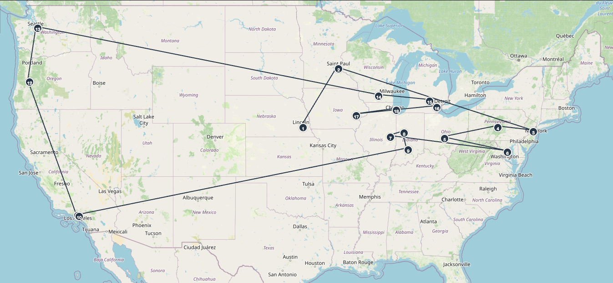

Managing and mitigating the negative effects of long-haul travel is a timely challenge facing collegiate athletics departments. This was particularly evident to me when I was watching the women's tennis NCAA tournament draw in the spring. There were a remarkable number of teams that had to travel what I perceived to be substantial distances for their first round matches. It did not appear to me that the optimal set of match-ups was identified to minimize the distance traveled while maintaining the appropriateness (e.g., in terms of RPI or other indicators of competitive level) of the two teams competing. Ultimately, this is one of a few examples I can think of where a scheduling and route optimization data science problem would be relevant.

While building a 64-team NCAA women's tennis tournament would be a fun project, it would likely take quite a bit of bandwidth and computational power. I thought it would be good to start to demonstrate a simpler example of a scheduling and route optimization problem. To do this, I decided to start by taking the 2025 Big Ten football schedule and try to identify the route someone would need to take to visit every Big Ten football stadium for a home game while minimizing the total distance traveled. 

The full project and the code to do all of the subsequently described web-scraping, cleaning, and analysis can be found at my github: https://github.com/emalyvatne/bigtenfootball_routeoptimization

#### Big Ten Football Context

Starting this data science problem involves collecting:  

1. The exact location (e.g., latitude and longitude) of each Big Ten stadium
2. The Big Ten football schedule

##### Big Ten School Details and Distance Matrix

The first assumption we will make in this problem is that the stadium is located in a negligible distance from the latitude and longitude of the city that the university is listed in. This also means we are not accounting for certain things such as mode of travel (e.g., driving versus flying) and ancillary details such as distance between a given airport and that stadium. While these things will inevitably add up when traveling to 18 schools, we are overlooking these details for the sake of this problem. In a more comprehensive approach to this question, I would like to have included the flight tracker API and Google Maps API to account for more accurate estimates of distances traveled. With all of that being said, we'll proceed with this question by obtaining the latitude and longitude of the Big Ten institutions by using a simple webscraper to collect this information off of Wikipedia: 

```
import pandas as pd
from bs4 import BeautifulSoup
import requests
from lat_lon_parser import parse
pd.options.display.max_columns = None
import os
 
# get URL
page = requests.get("https://en.wikipedia.org/wiki/Big_Ten_Conference")
 
# scrape webpage
soup = BeautifulSoup(page.content, 'html.parser')
 
table = soup.findAll('table')[1]
tbody = table.find('tbody')
data = []
# iterate through each stadium listing in the table
for i, row in enumerate(tbody.findAll('tr')):

    # ignore header row
    if i == 0: continue
    stadium = row.find('th')
    link = stadium.find('a')['href']

    # click into the stadium wikipedia page and extract latitude and longitude coordinates
    soup2 = BeautifulSoup(requests.get(f'https://en.wikipedia.org{link}').content, 'html.parser')
    loc = soup2.find('span', class_='geo-dms')
    lat = parse(loc.find('span', class_='latitude').getText())
    lng = parse(loc.find('span', class_='longitude').getText())
    data.append([row.find('th').getText().strip(), lat, lng, *[col.getText().strip() for col in row.findAll('td')]])

# assemble dataframe
COLUMNS = ['Institution', 'Latitude', 'Longitude', 'Location', 'Founded', 'Joined', 'Type', 'Enrollment',
           'Endowment', 'Nickname', 'Colors.Blank']
full_wiki_locations = pd.DataFrame(data, columns = COLUMNS)

# cleaned stadiums
clean_locations = full_wiki_locations[['Institution', 'Latitude', 'Longitude', 'Location']]
```

Next, we need to create a matrix of distances between each of the 18 schools. We will leverage the `geopy` package that provides the geodesic distances between two geo-coordinates, or the shortest path between two points on a curved surface. 

Here is the code for those computations:

```
import pandas as pd
from geopy.distance import geodesic
import os

# join each team name with abbreviations table to get tricode
df = pd.read_csv(f"{output_dir}/arena_info.csv")
TEAMS = sorted(df['Institution'].to_list())


# group latitude and longitude info into coordinate tuples
df['Coords'] = df.apply(lambda x: (x['Latitude'], x['Longitude']), axis=1)

# manipulate object type from dataframe -> dictionary
coords_dict = df.set_index('Institution')[['Coords']].to_dict(orient='index')

# compute distance between each arena
miles = []
for t in TEAMS:
    for tt in TEAMS:
        distance = geodesic(coords_dict[t]['Coords'], coords_dict[tt]['Coords']).miles
        miles.append([t, tt, distance])
mile_df = pd.DataFrame(miles, columns = ['src', 'dest', 'miles'])

# compute distance between each arena
miles = []
for t in TEAMS:
    distance = [geodesic(coords_dict[t]['Coords'], coords_dict[tt]['Coords']).miles for tt in TEAMS]
    miles.append([t, *distance])
mile_df_wide = pd.DataFrame(miles, columns = ['', *TEAMS])
```
I threw this matrix into power bi for a quick vizualization of distances between schools. Intuitively, the west coast additions consistently travel absurd distances. (The diagonal line of 0s is where that school is lined up with itself).





